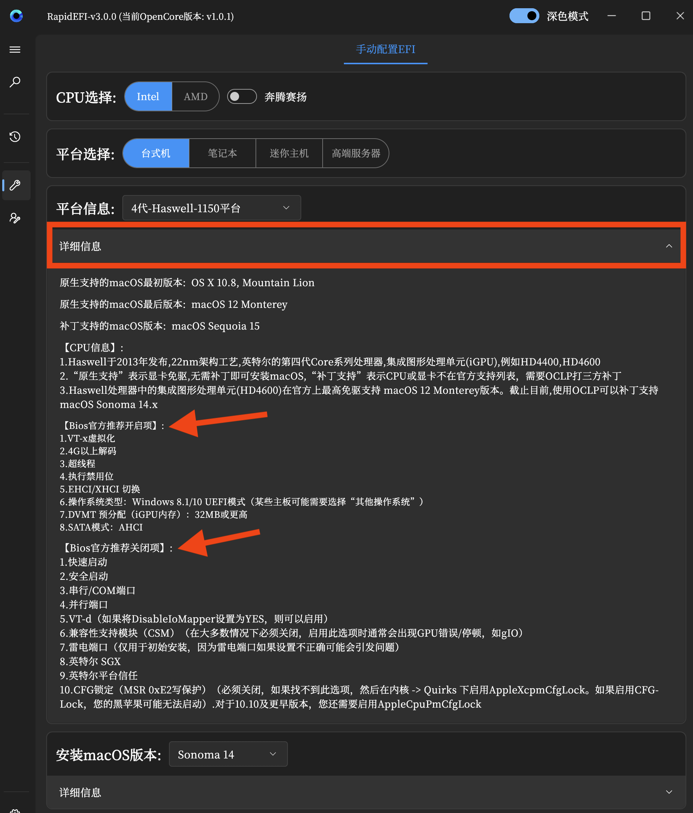

# 工具使用指南

## RapidEFI使用正确姿势?

如果你打算使用该工具配置EFI，你需要做好基础准备：

#### 1）.请先设置好黑苹果基础BIOS设置(这是前提)

不清楚的可以参考该工具软件【帮助信息】

以四代平台为例：

如果BIOS比较简陋，比较通用的BIOS设置是：

【开启项】：

- SATA模式AHCI    

- EHCI/XHCI   

- 4G 以上解码 (没有此选项，可以根据需要添加npci=0x2000引导参数)

- 操作系统类型：选择其他操作系统

【关闭项】：

- 快速/安全启动        

- 兼容性模块CSM

- Re-Size BAR Support (通常位于高级>PCI 子系统. 此项一般存在于新平台2020年之后的bios中) 

- CFGLock关闭是可选的，初始安装你可以不管(config配置默认勾选CFGlock配置了）

  说明：首先这个CFGLock选项只有Intel平台存在，如果有人在AMD平台说卡EB了，叫你去关闭CFGLock，那你可以去揍他了，AMD平台根本就没有CFGLock！

#### 2）.确定你的配置所属平台

软件中以CPU类型和CPU架构为准 

#### 3）.如果你确认使用该工具配置EFI，请始终保持【前期精简，后期完善】原则，可以减少问题！
尤其笔记本，别看见是笔记本可能适用，就添加,这些建议在安装完系统后再完善（随便举个例子，例如:电池读数，自动亮度补丁，亮度快捷键，这些随便一个都有可能卡代码）.如果使用工具生成的EFI出现无法引导，自己按照OC指南可以引导，那可能是工具读取的静态配置文件个别填写错误，对，你没看错，大部分都是提前准备好的静态数据，所以存在手写填错的情况！建议贴平台配置，提issue(报告问题)！当然成功也可以进行反馈！

#### 4）.使用该工具成功安装系统后，以下是进一步完善建议：

-  修改三码(虽然工具随机生成了三码，但还是建议后边自行生成)
-  定制USB(比如蓝牙内建,工具并未定制)
-  变频睿频
-  睡眠

  

  

  

  

  

  

  

  

  

  

  

  
